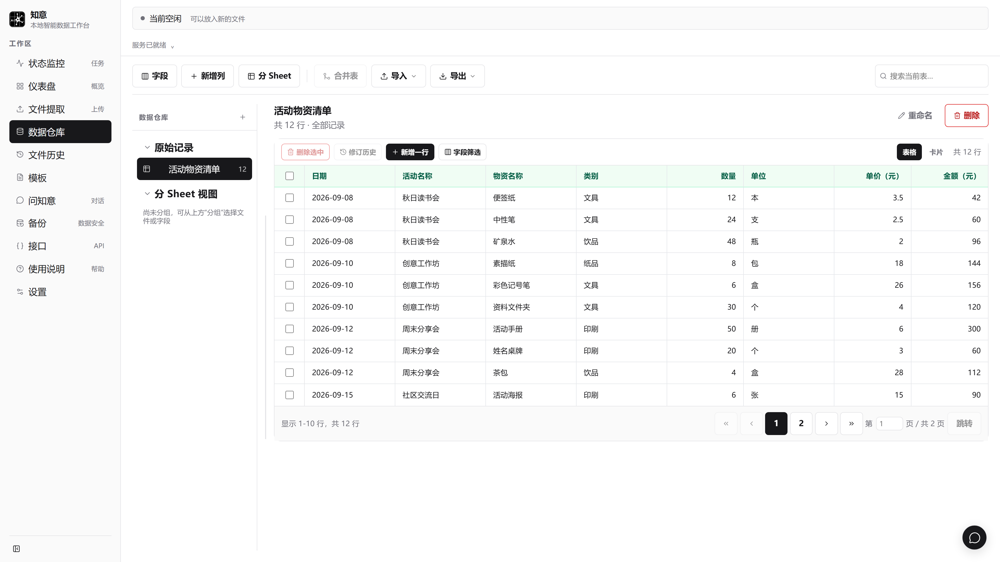

# 知意

知意是一款让通用大模型「知道意思」的语义理解工具。它做的不是「识别文字」，而是通过你定义的字段模板——一套**微型指令集**——让模型理解文档里的语义差异、注入业务逻辑，把任意文档变成可信、可追溯、可导出的结构化数据。

> 当前版本：`v0.3.0 Beta`。适合体验、学习和受控场景试用。所有 AI 结果在用于财务、库存或其他重要业务前，都必须人工核验。安装包见 [Releases](https://github.com/ha123-png/zhiyi/releases/tag/v0.3.0)。

<p align="center"></p>

## 界面预览



## 设计哲学

**知意，是「知道意思」，不是「识别文字」。**

大多数文档工具做的是「识别」：把文字从图片里抠出来，剩下「它是什么意思」还得靠人。知意做的是「理解」：让通用大模型真正看懂文档的语义，然后按你的要求，把「意思」落成结构化数据。

它不预训练任何「发票模板」「送货单模板」。它的核心是一套**微型指令集**：

> 你告诉它「要哪些字段」，它就编译出动态的字段约束 + 结构化提示，让任意多模态模型按约束输出、注入领域知识，再由规则引擎和人工审核兜底正确性。

这带来几个关键结果：

- **通用，而非专用**：错题本、批改作业、发票、送货单、新闻拆解……都是同一套引擎换一个字段模板，零代码。
- **模型自由，而非「本地优先」**：本地模型守住数据边界，云端模型换来更快更好的效果。同一个工具，随任务切换模型。
- **可信，而非「模型保证」**：正确性靠「规则校验 + 人工审核 + 可追溯」的闭环，不靠模型一句「我猜的」。

## 它能做什么

### 核心锚点：发票与送货单

知意内置了发票、送货单模板——这是它出发的地方，也是最核心的场景。

小微企业的送货单几乎没有两张格式完全一样：有的排版不同，有的还是手写体。纯 OCR 只能「把字抠出来」，剩下「哪个是数量、哪个是金额、谁卖给谁」还得靠人去对，面对手写体更是吃力。

知意靠的是大模型的眼睛和语义：它能看懂版面和业务关系——抬头公司是送货方、客户名称是收货方、「柒拾万元整」是总金额——而不是靠固定的格式位置去猜。**这就是「识别文字」和「知道意思」的区别，也是它叫「知意」的原因。**

### 换一个字段模板，就是另一个工具

| 场景   | 字段模板（示例）                  | 结果            |
| ---- | ------------------------- | ------------- |
| 错题本  | 题目、地区、错题分析、正确答案、举一反三题目与答案 | 可导出的错题本 Excel |
| 批改作业 | 姓名、学号、第 1～7 题对错（提示词附正确答案） | 判分表           |
| 新闻拆解 | 标题、时间、地点、摘要               | 按条归档的数据       |

模板支持导入 / 导出 JSON，可相互分享。

## 从一份文件开始

1. **连接模型。** 使用已安装的 LM Studio、Ollama，或兼容的云端接口。知意不捆绑模型服务和模型文件。
2. **保存模板。** 自己定义字段，或让 AI 根据需求和样例起草，再检查字段类型、含义与建议规则。
3. **上传并整理。** 选择模板，也可使用智能匹配。拿不准时由你决定，不强行选择。
4. **检查结果。** 提取结果会先进入仓库；没有待处理事项时自动完成，有规则或名称提示时保留待核对状态。入表不等于已经人工检查。
5. **继续使用。** 表格管理、卡片阅读、搜索、分 Sheet、导出，下一批资料继续使用模板。

完整起步说明见 [快速开始](docs/QUICK_START.md)。

## 主要能力

- **微型指令集：** 字段模板编译成输出结构和提示，结合字段含义与业务要求指导模型理解。支持 AI 生成模板、建议规则和智能匹配；生成草稿由人检查确认。
- **模板积累：** 字段、用途、提示、展示与规则共同版本化。可查看差异并把历史版本设为当前，不复制成冗余新版本。旧任务保留当时引用。
- **结果可核对：** 必填、范围、枚举、整段文字格式、计算与汇总规则；正则支持试填。用户决定修正或明确忽略提示。
- **来源与范围：** 原文件独立保留。较大文件可能只向模型提供部分内容，界面与导出记录处理范围；局部读取不改写原件。
- **仓库与导出：** 数据编辑、修订记录、卡片、分 Sheet、导入与合并。待核对来源在 Excel、CSV、JSON 中保留标记；独立副本不会被来源任务后续确认自动改写。
- **模型方案：** 本地或云端方案、任务配置快照、连接检查、启动与加载提示、可读诊断。文字连接成功不等于视觉能力合格。
- **API / MCP：** 权限范围内的任务查询、限定目录导入、数据读取、带版本检查的修改与导出。默认关闭，按需授权。
- **仪表盘：** 查看处理量、成功率、耗时与趋势。
- **本地备份与桌面运行：** 完整业务备份恢复、单实例管理、安装升级、关闭后台进程。普通卸载保留用户数据。

## 格式与兼容边界

支持 PDF、DOCX、XLSX、常见图片、TXT/Markdown 等输入。复杂文件中的表格结构、公式、版式与图文关系并非都能完整提取；图片和扫描件需要视觉模型。CSV/JSON/Excel 数据导入可直接用于仓库，不必绕模型。

本轮使用虚构材料实测：LM Studio 下的 Qwen 3.5 4B 与云端 Qwen 3.6 Flash 文本链路通过；云端视觉样例通过，本地 4B 视觉样例把“未填写”保留为文字而非预期空值，记为质量差异。Ollama 协议和失败路径有自动测试，本轮没有真实 Ollama 推理证据。

有界压力覆盖 80 页 PDF、36,006 行三工作表 XLSX、20,002 段 DOCX、约 3.9 MB 长文本、20 帧 TIFF 及 40 个排队任务。原件摘要、局部范围、数量与重复确认检查通过；这些是有限样例，不是任意大小、无限时长或统一准确率保证。

## Windows 安装与升级

安装包以 `Zhiyi-*-win-x64-setup.exe` 命名。从本仓库 [Releases](https://github.com/ha123-png/zhiyi/releases) 获取，核对随包 SHA-256。当前未进行 Authenticode 签名，不关闭系统安全防护来运行未知来源的副本。

升级前建议使用应用内完整备份。普通卸载只移除程序；明确选择删除数据才会清除本地资料。安装器只关闭目标安装目录的知意，不按进程名关闭其他安装。

## 开发与检查

使用 Node.js 24、Python 3.12 和 uv；本轮锁定环境见依赖文件。

```powershell
git clone https://github.com/ha123-png/zhiyi.git
cd zhiyi
npm ci
uv sync --project apps/api --dev --locked
npm run dev:safe
```

Web 为 `http://127.0.0.1:5180`，API 为 `http://127.0.0.1:8010`。模型任务默认串行处理。

```powershell
npm run test:web
npm run build:web
uv run --project apps/api ruff check apps/api/src apps/api/tests
uv run --project apps/api pytest apps/api/tests --basetemp=.local/pytest-fresh
npx playwright install --only-shell chromium
npm run test:browser
uv run --project apps/api python scripts/verify-release-pressure.py
```

浏览器和压力检查使用隔离合成资料，不调用付费模型。pytest 临时目录应使用新的目录。在干净检出、已安装 NSIS 的 Windows 环境构建：

```powershell
./scripts/build-release.ps1 -BuildInstaller
./scripts/smoke-release-lifecycle.ps1
```

构建生成版本、源码摘要、迁移版本、SBOM 和依赖许可记录。测试不能承诺以后每次升级都无缺陷，新增业务改动仍需相关验收。

## 隐私与项目边界

默认数据目录为 `%LOCALAPPDATA%\Zhiyi`。调用本地地址时相关模型请求在该本地服务处理；选择云端地址时相关文档内容、字段和提示发送给该服务商。API Key 使用 Windows Credential Manager；不把密钥、业务原件或完整备份提交到仓库。

API 默认仅监听本机。MCP 权限默认关闭，导出同时需要文件访问和数据读取，新授权在新连接生效。当前没有组织账户或公网身份认证，不能直接作为公网服务部署。

目前专注 Windows，不提供手机 App，也不提供企业级稳定性承诺。详见 [隐私与数据边界](docs/PRIVACY.md)、[安全政策](SECURITY.md) 和 [更新记录](CHANGELOG.md)。

## 项目背景

本项目由产品构想、架构取舍、真实流程验收和 AI 编程代理协作完成。AI 参与了大量实现，项目维护者负责需求设计、风险边界、测试、代码验收和发布决策。我们欢迎对架构、质量、安全和交互提出具体 Issue。

## 参与贡献

请阅读 [CONTRIBUTING.md](CONTRIBUTING.md)。提交安全问题时不要创建公开 Issue，请按 [SECURITY.md](SECURITY.md) 操作。

## 许可证

知意源代码采用 [Apache License 2.0](LICENSE) 发布。第三方依赖仍分别遵循其自身许可证；发行构建会生成 SBOM 与第三方许可证清单。
